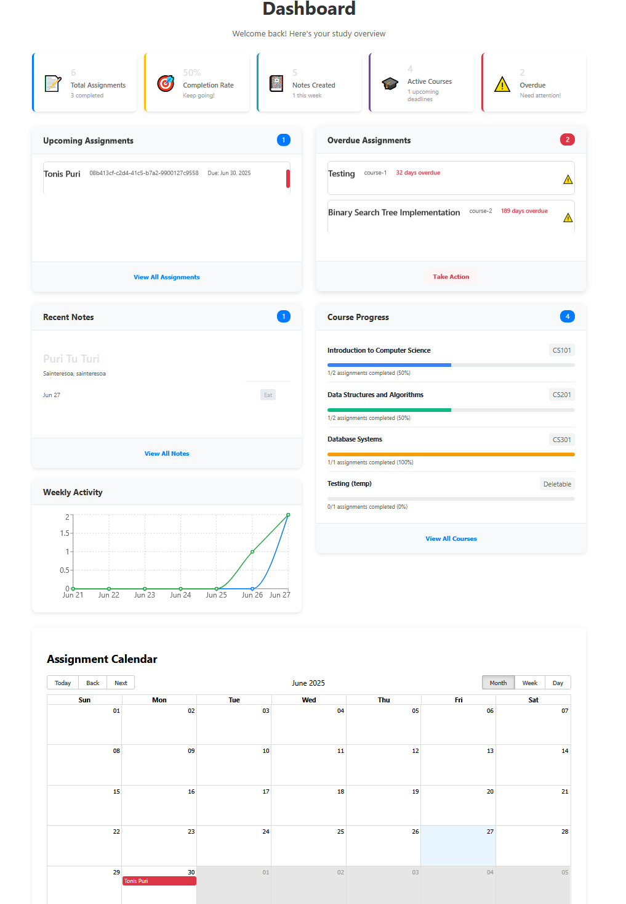
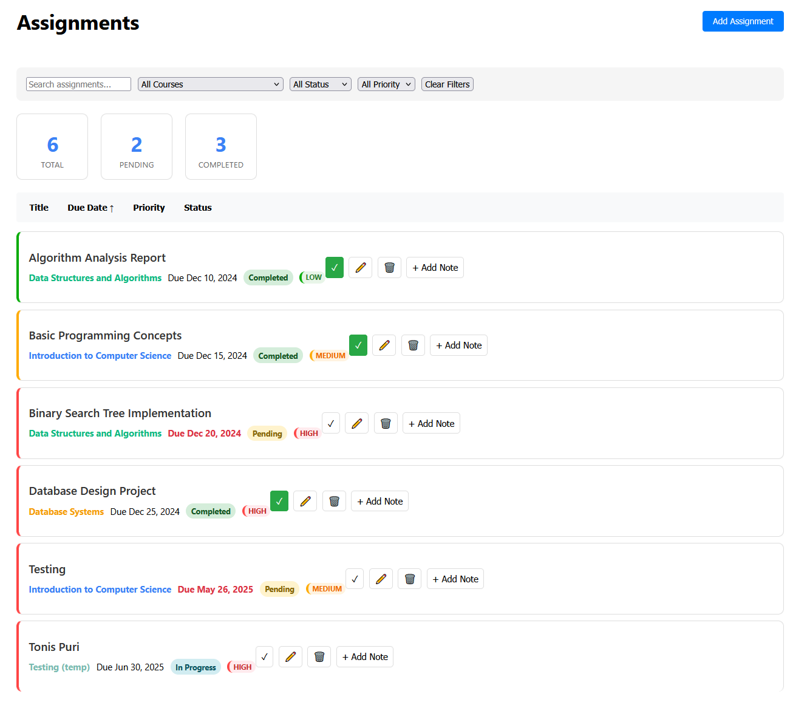
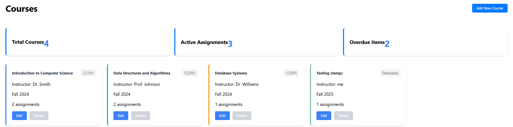
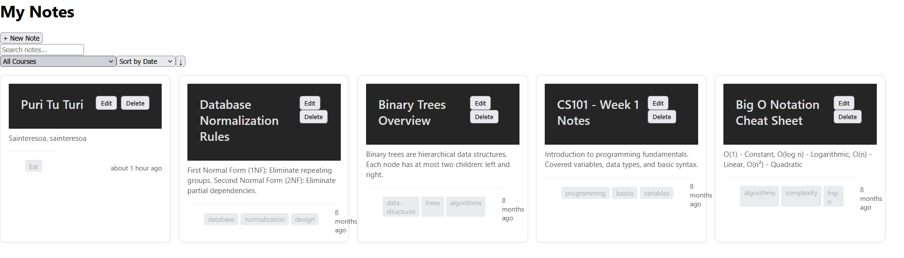

# Study Planner - Student Assignment Tracker

A comprehensive web application for students to manage assignments, courses, and notes. Built with React, TypeScript, and Node.js.

## Features

- **Assignment Management**: Create, edit, and track assignments with due dates, priorities, and status
- **Course Organization**: Manage courses with color coding and semester tracking
- **Note Taking**: Create and organize notes linked to assignments and courses
- **Dashboard Overview**: Visual dashboard with upcoming assignments, overdue items, and progress tracking
- **Calendar Integration**: View assignments in calendar format

## Installation

### Prerequisites

- **Node.js** (v18 or higher)
- **npm** (v8 or higher)
- **Git**

### Quick Start

1. **Clone the repository**
   ```bash
   git clone https://github.com/Sandro-Kiladze/study-planner.git
   cd study-planner
   ```

2. **Install dependencies**
   ```bash
   npm install
   ```

3. **Start the development servers**
   ```bash
   npm start 
   ```

4. **Open your browser**
   - Frontend: http://localhost:3000
   - Backend API: http://localhost:5000

## Development Setup

### Project Structure

```
study-planner/
├── client/                 # React frontend
│   ├── src/
│   │   ├── components/     # Reusable UI components
│   │   ├── pages/         # Main page components
│   │   ├── services/      # API service layer
│   │   ├── hooks/         # Custom React hooks
│   │   └── styles/        # CSS/styling files
├── server/                # Node.js backend
│   ├── src/
│   │   ├── routes/        # API routes
│   │   ├── models/        # Data models
│   │   └── data/          # JSON data files
└── shared/                # Shared TypeScript types
```

### Development Scripts

```bash
# Start both client and server
npm start

# Build for production
npm run build

# Run tests
npm test

# Lint code
npm run lint
```

## API Documentation

### Base URL
```
http://localhost:5000/api
```

### Endpoints

#### Assignments

| Method | Endpoint | Description |
|--------|----------|-------------|
| GET | `/assignments` | Get all assignments |
| GET | `/assignments/:id` | Get a specific assignment |
| POST | `/assignments` | Create a new assignment |
| PUT | `/assignments/:id` | Update an assignment |
| DELETE | `/assignments/:id` | Delete an assignment |

**Query Parameters for GET /assignments:**
- `courseId`: Filter by course ID
- `status`: Filter by status (pending, in-progress, completed)
- `priority`: Filter by priority (low, medium, high)
- `search`: Search in title and description

#### Courses

| Method | Endpoint | Description |
|--------|----------|-------------|
| GET | `/courses` | Get all courses |
| GET | `/courses/:id` | Get a specific course |
| POST | `/courses` | Create a new course |
| PUT | `/courses/:id` | Update a course |
| DELETE | `/courses/:id` | Delete a course |

#### Notes

| Method | Endpoint | Description |
|--------|----------|-------------|
| GET | `/notes` | Get all notes |
| GET | `/notes/:id` | Get a specific note |
| GET | `/notes/assignment/:assignmentId` | Get notes for an assignment |
| POST | `/notes` | Create a new note |
| PUT | `/notes/:id` | Update a note |
| DELETE | `/notes/:id` | Delete a note |

### Example API Usage

**Get all assignments:**
```bash
curl http://localhost:5000/api/assignments
```

**Create a new assignment:**
```bash
curl -X POST http://localhost:5000/api/assignments \
  -H "Content-Type: application/json" \
  -d '{
    "title": "Research Paper",
    "description": "Write a 10-page research paper",
    "dueDate": "2024-01-15",
    "courseId": "course-1",
    "priority": "high",
    "status": "pending"
  }'
```

## User Guide

### Getting Started

1. **Access the Application**
   - Open your browser and navigate to http://localhost:3000
   - You'll see the main dashboard with an overview of your academic tasks

2. **Set Up Your Courses**
   - Click on "Courses" in the navigation menu
   - Click "Add Course" to create your first course
   - Fill in the course details: name, code, instructor, and select a color
   - Click "Save" to create the course

3. **Add Your First Assignment**
   - Navigate to "Assignments" in the menu
   - Click "Add Assignment" to create a new assignment
   - Fill in the assignment details:
     - Title (required)
     - Description (optional)
     - Select the course from the dropdown
     - Set the due date
     - Choose priority level
     - Set initial status
   - Click "Save" to create the assignment

### Managing Assignments

#### Creating Assignments
1. Go to the Assignments page
2. Click the "Add Assignment" button
3. Fill in the required information
4. Click "Save"

#### Updating Assignment Status
- Click on any assignment in the list
- Use the status dropdown to change the status
- Changes are automatically saved

#### Filtering and Searching
- Use the filter panel on the left to filter by:
  - Course
  - Status
  - Priority
  - Due date range
- Use the search bar to find assignments by title or description

### Taking Notes

#### Creating Notes
1. Navigate to the Notes page
2. Click "Add Note"
3. Enter a title and content
4. Optionally link to a course or assignment
5. Add tags for better organization
6. Click "Save"

#### Linking Notes to Assignments
- When creating or editing a note, you can link it to a specific assignment
- This helps keep your study materials organized
- You can view all notes for an assignment from the assignment details

### Using the Dashboard

The dashboard provides a quick overview of your academic progress:

- **Upcoming Assignments**: Shows assignments due in the next 7 days
- **Overdue Assignments**: Highlights assignments past their due date
- **Recent Notes**: Displays your most recent notes
- **Course Progress**: Shows assignment completion by course

### Calendar View

1. Navigate to the Calendar page
2. View assignments by month, week, or day
3. Click on any assignment to view details
4. Use the calendar to quickly see your schedule

### Tips for Effective Use

1. **Regular Updates**: Update assignment status as you work on them
2. **Use Tags**: Tag your notes for easy searching and organization
3. **Set Realistic Due Dates**: Use the priority system to manage your workload
4. **Link Notes**: Connect notes to assignments for better organization
5. **Check the Dashboard**: Regularly review your dashboard for upcoming deadlines

## Screenshots

### Dashboard

*Main dashboard showing upcoming assignments, overdue items, and course progress*

### Assignments

*Assignment management with filtering and status tracking*

### Courses

*Courses Interface*

### Notes

*Note-taking interface with course and assignment linking*

### Calendar View

*Calendar view showing assignments by due date*

## Support

If you encounter any issues or have questions:

1. Check the [Issues](https://github.com/Sandro-Kiladze/study-planner/issues) page
2. Create a new issue with detailed information
3. Include steps to reproduce the problem

---

**Happy Studying! 📚✨**